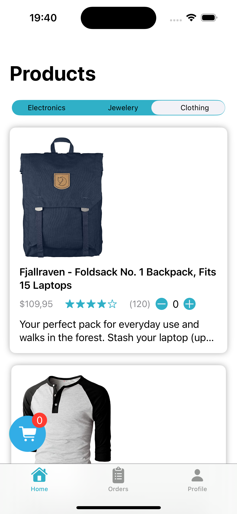
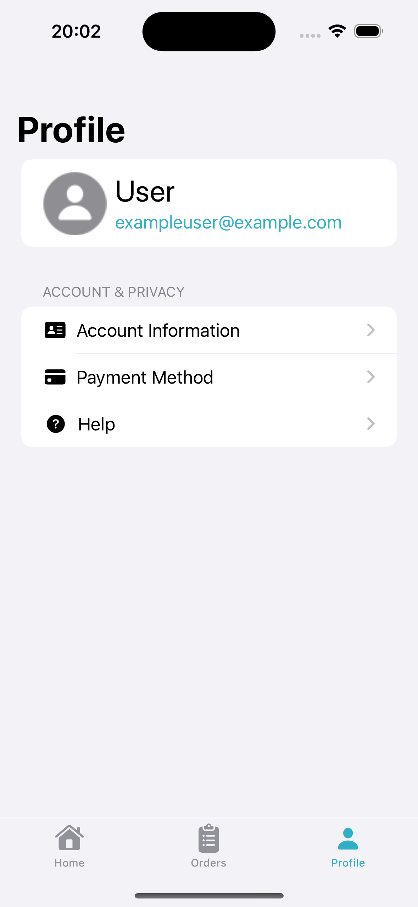

# Online-Shop
This is an iOS Project developed with Swift and SwiftUI that serves as a blueprint or inspiration for mobile Online Shops

## API Integration and Data Fetching

### Overview

This application uses the [Fake Store API](https://fakestoreapi.com) to fetch product data. The API provides data in `ProductResponse` format, which is mapped to the internal `ItemModel`.

### Data Models

- **`ProductResponse`**: Raw data model from the API with fields like `id`, `title`, `price`, `description`, `category`, and `image`.
- **`ItemModel`**: Internal model used within the application, possibly with additional computed properties.

### `fetchProducts` Function

The `fetchProducts` function performs the following:

1. **Fetches Data**: Makes a network request to the Fake Store API.
2. **Decodes Response**: Parses JSON data into `ProductResponse` objects.
3. **Maps to Internal Model**: Transforms `ProductResponse` into `ItemModel`.
4. **Updates State**: Refreshes the application’s data state.

#### Example Implementation

```swift
func fetchProducts() {
    let url = URL(string: "https://fakestoreapi.com/products")!

    let task = URLSession.shared.dataTask(with: url) { data, response, error in
        guard let data = data, error == nil else { return }

        do {
            let productResponses = try JSONDecoder().decode([ProductResponse].self, from: data)
            let itemModels = productResponses.map { productResponse in
                ItemModel(
                    id: productResponse.id,
                    title: productResponse.title,
                    price: productResponse.price,
                    description: productResponse.description,
                    image: productResponse.image,
                    category: productResponse.category,
                    rating: Rating(rate: productResponse.rating.rate, count: productResponse.rating.count)
                )
            }
            DispatchQueue.main.async {
                self.items = itemModels
            }
        } catch {
            // Handle error
        }
    }
    task.resume()
}


```

### Week 1

<div>
    
    
</div>
